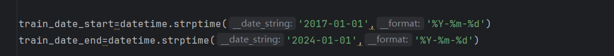
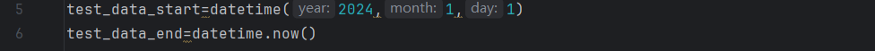
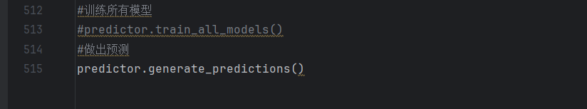
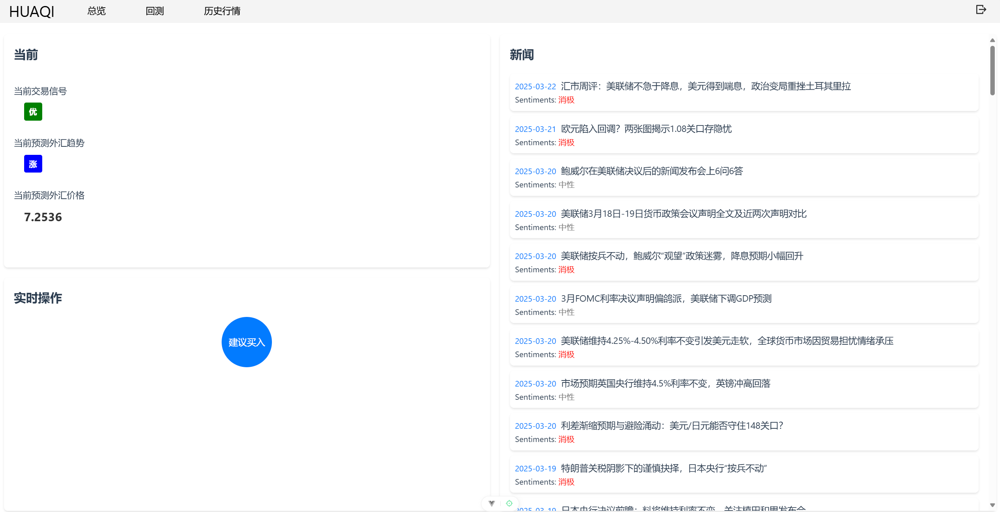
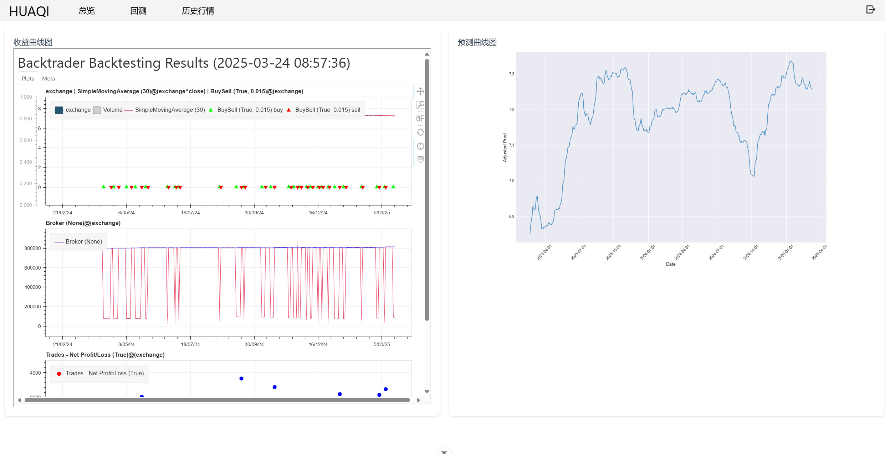
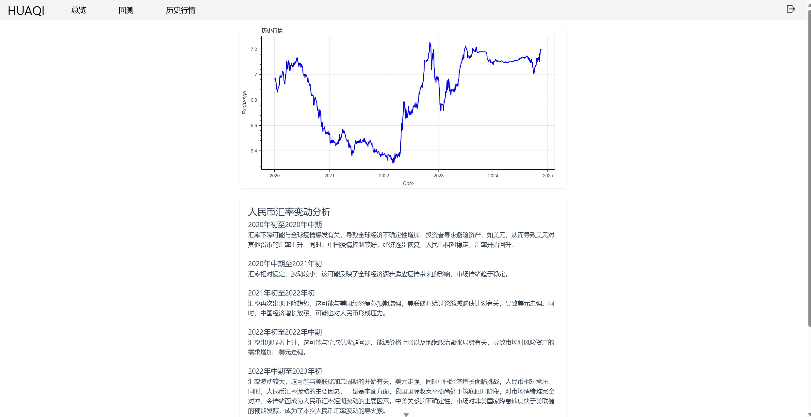

# 智能外汇交易分析平台


### 介绍

- 在全球经济一体化背景下，汇率波动对外贸企业、金融机构和个人投资者的影响日益显著。精准预测汇率趋势成为降低风险、优化收益的核心需求。

- 实际的模型实现了 自动化数据处理、智能化模型预测和一键式回测功能，但由于时间、人力限制，此处的平台网页只展示了原型。


### 项目结构

```shell
huaqi
├─back #平台后端
├─front #平台前端
├─predict model #完整的模型以及数据
└─README.md #说明文件
```


### 模型操作手册

#### 操作方法（简易）

直接运行”run_all.py“，在运行成功之后会生成最新的拟合图像与回测结果


#### 模型概述

模型分为三个板块

1、数据提取（数据提取.py）、数据划分（test_data.py，train_data.py）

2、预测模型训练与预测（predict_model.py）

3、回测信号生成、回测展示


#### 单独执行流程

##### 1、数据提取.py

从Wind api接口和 爬虫 提取最新的汇率数据、新闻数据等更新到本地数据库：即”本地数据集“文件夹（采取此步原因为Wind api每周流量限流，因此采取本地数据库方式最大程度节省流量）

##### 2、train_data.py、test_data.py

在py文件的开始选定训练集需求时间段与测试集需求时间段（目前选择训练集为2017/1/1-2024/1/1，测试集为2024/1/1-现在），自动生成训练集和测试集，分别更新至”训练数据集“文件夹与”回测数据集“文件夹

train_data.py:



test_data.py:



##### 3、predict_model.py

读取1、2步生成的数据，进行训练或回测（本地已有已训练的模型，可直接进行预测），输出“res_pred_data.xlsx”

**若要重新训练**，即调用图中”predictor.train_all_model";否则直接执行预测的集成模块



##### 4、backtest_data.py 

读取3生成的信号，为回测处理做好数据准备，生成“back_test_data.xlsx"至“回测数据集”

##### 5、backtest.py

读取4中生成的数据，进行回测，生成最终回测曲线与胜率等指标。


### 平台功能模块

##### 总览

展示 当前交易信号、当前预测外汇趋势、当前预测外汇价格，并给出实时操作建议。

右侧展示当日新闻，这些新闻同样也是模型中汇率预测的考虑因素。




##### 回测

展示两张曲线图，分别是收益曲线图、预测曲线图。

预测曲线：基于融合LLM（大语言模型）与时间序列模型的智能分析体系。通过LLM处理新闻、市场情绪等非结构化数据，纳入多维度信息；结合短时间序列模型与LSTM模型，实现实时数据接收与动态预测。

根据预测汇率对 实际汇率的对比，计算模型的回测效果，展示收益曲线图。




##### 历史行情

该模块分为两个子模块：历史行情图、重要历史事件解读。




### 安装步骤

1. **克隆代码仓库**

   ```shell
   git clone https://github.com/1193600423/huaqi.git
   ```

2. **前端安装**

   ```shell
   cd front
   npm install
   npm run dev 
   ```

3. **后端启动**

   - 直接运行 BackApplication


