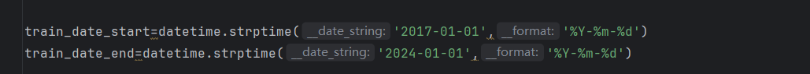

## 模型操作手册

#### 操作方法（简易）

直接运行”run_all.py“，在运行成功之后会生成最新的拟合图像与回测结果

#### 模型概述

模型分为三个板块

1、数据提取（数据提取.py）、数据划分（test_data.py，train_data.py）

2、预测模型训练与预测（predict_model.py）

3、回测信号生成、回测展示

#### 单独执行流程

##### 1、数据提取.py

从Wind api接口和 爬虫 提取最新的汇率数据、新闻数据等更新到本地数据库：即”本地数据集“文件夹（采取此步原因为Wind api每周流量限流，因此采取本地数据库方式最大程度节省流量）

##### 2、train_data.py、test_data.py

在py文件的开始选定训练集需求时间段与测试集需求时间段（目前选择训练集为2017/1/1-2024/1/1，测试集为2024/1/1-现在），自动生成训练集和测试集，分别更新至”训练数据集“文件夹与”回测数据集“文件夹

train_data.py:

test_data.py:

##### 3、predict_model.py

读取1、2步生成的数据，进行训练或回测（本地已有已训练的模型，可直接进行预测），输出“res_pred_data.xlsx”

**若要重新训练**，即调用图中”predictor.train_all_model";否则直接执行预测的集成模块

##### 4、backtest_data.py 

读取3生成的信号，为回测处理做好数据准备，生成“back_test_data.xlsx"至“回测数据集”

##### 5、backtest.py

读取4中生成的数据，进行回测，生成最终回测曲线与胜率等指标。